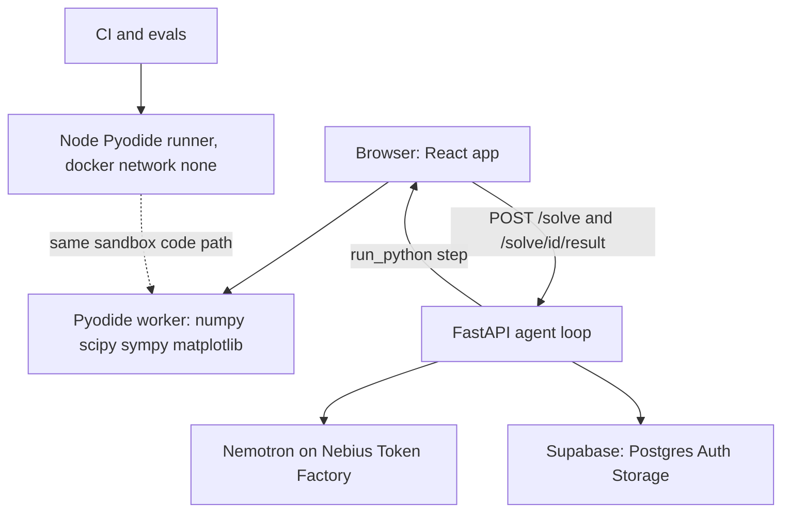

# StudyForge

A study agent for engineering students that can't make up numbers. Nemotron (via Nebius
Token Factory) plans the solution and writes Python, a sealed Pyodide sandbox in the
student's browser does the computing, and the answer is checked twice before it is
explained: two independent methods must agree, and every number in the explanation must
come from the sandbox output or the question. Around the solver sit deadlines and
reminders, quizzes, prep packs, cited web answers, and ChemLab reactor and distillation
simulations.

**Status: work in progress, hackathon build** (Nebius x NVIDIA Global AI Hackathon, Track 2).
Only the web app is merged to `main`. The backend lives on feature branches until A2
lands. The Nemotron models have **not been called yet**, so this README makes no claims
about accuracy, latency or cost. <!-- TODO(F4): update status after A2 and G10 merge -->

## How a solve works

1. **Classify.** The `router` role labels the question `calc` or `concept`. Concept
   questions get a prose answer with no computed numbers.
2. **Notes.** The student's uploaded notes are searched once; hits enter the prompt as
   quoted data, never as instructions.
3. **ChemLab or solver.** If the question fits a ChemLab template, the server builds the
   `run_python` code itself from range-checked floats (no model-written string reaches
   the code). Otherwise the `solver` role writes one Python script that computes the
   answer by two independent methods. At most 4 tool steps and 90 s per solve.
4. **Sandbox.** The API returns a `run_python` step; the browser's Pyodide worker runs
   it and posts the result back. The server never executes model-written code.
5. **Verify.** `verify()` requires `answer` and `check` with the same unit that agree
   within 0.1 %. A failure triggers a repair prompt; a disagreement triggers one
   re-solve by a different method (`cross_check` role) and is flagged if it still differs.
6. **Explain.** The solver writes the worked answer from the sandbox result as JSON.
7. **Number guardrail.** Every number in the answer must be within 0.5 % of a sandbox
   value, a number in the question, or a physical constant. Otherwise the answer is
   regenerated once, and flagged with `confidence: "low"` if it still fails.

Every failure ends as a `final` step with low confidence and no unverified numbers, never
an HTTP error.

## Architecture



The sandbox worker (`web/src/sandbox/worker.ts`) removes network APIs (`fetch`,
`XMLHttpRequest`, `WebSocket`, nested workers and others) once user code is about to run,
kills runs after 10 s, caps stdout and figures, and the main thread shape-checks every
message from it. Mermaid diagrams are rendered with `securityLevel: 'strict'` and
re-sanitised with DOMPurify.

## Nemotron usage

`config/models.yaml` is the only place model IDs and prices live. Four roles:

| Role | Used for | Models tried in order | Reasoning |
| --- | --- | --- | --- |
| `router` | classify, pick a ChemLab template | nano, super | off |
| `solver` | write the Python, explain, concept answers | super | on |
| `cross_check` | re-solve by a different method | ultra, super | on |
| `vision` | transcribe photos and scanned PDF pages | vision | not sent |

JSON calls always force reasoning off. The client (`api/app/llm/client.py`) uses the
`openai` SDK against the Token Factory base URL with SDK retries disabled, so it can do
its own: up to 3 retries with backoff, a per-role timeout, an absolute per-solve deadline,
fallback down the role's model list, JSON repair, and a cost row per attempt (tokens,
latency, USD once prices are known). A record/replay HTTP transport lets CI run
model-dependent tests without a key.

Model IDs: only `super` (`nvidia/nemotron-3-super-120b-a12b`) is filled in; `nano`,
`ultra`, `vision` and all prices are `null` until ticket G10 confirms them from
`GET /v1/models`. A null model is skipped in its role's chain.
<!-- TODO(F4): fill model IDs, measured latency and cost after G10 / first live run -->

The agent has exactly six tools: `run_python`, `search_my_notes`, `web_search`,
`make_quiz`, `schedule_reminder`, `draw_diagram`. Unknown tools are refused in code. Until
their tickets land, the four service tools answer "not available".

## ChemLab templates

Plain numpy/scipy in `chemlab/templates/`, pytest-tested, and written to also run in Pyodide.

- `cstr.py`: liquid-phase CSTR, rate k(T)·CA^n, mole and energy balance; finds all steady
  states (multiplicity), flags stable ones, reports the lowest-temperature stable state.
- `pfr.py`: isothermal PFR, closed-form conversion for any order n.
- `batch.py`: isothermal batch reactor, same kinetics; conversion vs time and time for a
  target conversion.
- `mccabe.py`: McCabe-Thiele binary distillation (constant relative volatility, constant
  molar overflow): minimum reflux, stage stepping, feed stage, tray counts, an illustrative
  column diameter.

The 3D models and SVG drawings (`web/src/chemlab/`) are not built yet.
<!-- TODO(F4): describe ChemLab screens after CH4+ merge -->

## Setup

```bash
git clone https://github.com/studyforge-team/studyforge.git && cd studyforge       # https://github.com/studyforge-team/studyforge
cd web && npm install && npm run dev        # demo mode, no backend needed
cd api && pip install -e ".[dev]"           # after A2
cd api && uvicorn app.main:app --reload     # after A2
cp .env.example .env                        # then fill the names (never commit values)
```

## Demo mode

With `VITE_API_URL` unset, the web app uses a scripted mock (`web/src/api/mock.ts`). It
only knows one built-in sample (a first-order CSTR: "CSTR first-order reaction, k = 0.2
1/min, tau = 10 min. Find conversion."); the Python for it really runs in the Pyodide
worker. Any other question gets an honest low-confidence reply saying the model is not
connected. <!-- TODO(F4): hosted demo URL and any wider demo mode after A2/S4 -->

## Tests

| Suite | Command | Notes |
| --- | --- | --- |
| api | `cd api && pytest` | after A2; lint: `ruff check . && mypy app` (after T1) |
| chemlab | `cd chemlab && pytest` | after CH1a |
| web e2e | `cd web && npm run test:e2e` | Playwright; builds, then serves a preview |
| web lint | `cd web && npm run lint && npx tsc --noEmit` | oxlint on `main` today |
| runner | `node runner/node-pyodide.mjs` | after S1b; in docker with `--network none` |

`npm test` (vitest) is listed in AGENTS.md but not defined in `web/package.json` on `main`
yet. <!-- TODO(F4): confirm after T1/T5 -->

## Folder map

- `api/` FastAPI backend (agent loop, routers, tests)
- `web/` React + Vite + TypeScript frontend, Pyodide sandbox, ChemLab screens
- `chemlab/` simulation templates in plain Python, with tests
- `runner/` Node Pyodide runner for CI and evals
- `config/` model registry and settings
- `docs/` architecture, decisions, feedback log

## Licences

StudyForge is MIT licensed (see [LICENSE](LICENSE)). Third-party packages used, licences as
read from installed metadata where available:

| Package | Licence |
| --- | --- |
| openai (Python) | Apache-2.0 |
| httpx | BSD-3-Clause |
| pydantic, fastapi, pytest | MIT |
| numpy | BSD-3-Clause (plus bundled permissive terms) |
| scipy | BSD-3-Clause (metadata only holds a copyright text: verify) |
| Pillow | MIT-CMU: **pending team review** against the MIT/Apache/MPL allow-list |
| pypdfium2 | BSD-3-Clause / Apache-2.0: **pending team review** against the allow-list |
| react, react-dom, react-markdown, remark-math, rehype-katex, katex, mermaid, dompurify, pyodide, @base-ui/react, class-variance-authority, tailwindcss, vite, typescript, @playwright/test, oxlint | verify (`web/node_modules` not installed here; DOMPurify is MPL-2.0 or Apache-2.0 per upstream, unverified) |

<!-- TODO(F4): verify npm licences after npm install; add sqlalchemy, alembic, instructor, apscheduler, aiogram once A2 pins them -->

## Team

<!-- TODO(F4): names and roles (P1 Engine & ChemLab, P2 Backend & data, P3 Frontend & sandbox, P4 Quality & release) -->

Contributors and AI assistants: see [AGENTS.md](AGENTS.md).
